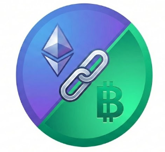

# BoonLink: Bridging Crypto Capital to Local Economy 🇹🇭💸



> **Hackathon Track:** Payment / Consumer Crypto / Real World Adoption

**BoonLink** is a decentralized payment bridge designed to connect global crypto capital with the local real-world economy. It empowers digital nomads to spend crypto (USDT/ETH) directly at local street vendors by scanning standard **PromptPay** QR codes, while merchants receive real-time confirmations via their existing **LINE** accounts—no new hardware or learning curve required.

---

## 🌟 The Problem

In digital nomad hubs like Chiang Mai, a significant payment friction exists:
1.  **The Holder's Dilemma:** Nomads hold significant liquidity in crypto (USDT), but local vendors, night markets, and TukTuks operate exclusively in Fiat (Thai Baht).
2.  **Merchant Resistance:** Local merchants rely on **PromptPay** (Thailand's national QR standard). They are reluctant to adopt complex Web3 wallets or purchase expensive crypto POS hardware.
3.  **Infrastructure Gaps:** Mobile networks in crowded markets or mountains are often unstable, causing mobile wallet payments to fail.

## 💡 The Solution

BoonLink delivers a **"Zero Friction"** payment experience:

1.  **📷 Universal Scan-to-Pay:** Customers scan the merchant's *existing* PromptPay QR code. BoonLink parses the payload, resolves the merchant's identity, and handles the crypto-to-fiat conversion logic.
2.  **💬 Instant LINE Notifications:** We leverage the most popular local app—**LINE**. Upon blockchain confirmation, merchants receive an instant push notification and a voice announcement (TTS), mimicking the UX of local banking apps.
3.  **📴 EIP-712 Offline Payments:** To solve connectivity issues, we implemented an **Offline Intent System**. Users generate cryptographically signed payment vouchers (EIP-712) offline, which merchants can scan and broadcast when connectivity is available.

---

## 🏗 System Architecture

### 1. Customer Web App
* **PromptPay Parser:** Decodes the ISO/CRC16 standard PromptPay QR payloads to extract merchant IDs (Phone/National ID).
* **Wallet Integration:** Seamless connection with MetaMask/WalletConnect on EVM chains (Base, BSC, Scroll).
* **Offline Signing:** Utilizes `eth_signTypedData_v4` to generate secure, tamper-proof payment authorizations without internet access.

### 2. Merchant Web App
* **LINE Integration:** A frictionless onboarding flow where merchants bind their LINE User ID to the system via a simple bot interaction.
* **Real-time Alerts:** Webhooks trigger Vercel Serverless Functions to push transaction receipts to LINE.
* **Voice Announcement:** Uses the Web Speech API to announce received amounts in Thai/English, ensuring vendors know they've been paid without looking at the screen.

### 3. Serverless API (Vercel)
* `/api/line-webhook`: Manages LINE Bot events and merchant identity binding.
* `/api/send-line`: Encapsulates the LINE Messaging API to deliver secure transaction notifications.

---

## 🚀 Getting Started

### Prerequisites
* Node.js 18+
* Vercel Account (for serverless functions)
* LINE Developers Channel (Messaging API)

### 1. Installation
```bash
npm install

📱 User Journey (Demo Flow)
👨‍🍳 Merchant Setup (One-Time)
Merchant adds BoonLink Bot as a friend on LINE.

Sends the command id to the bot to retrieve their unique User ID.

Pastes the ID into the Merchant Settings Page (/merchant/settings.html) and saves.

Result: The merchant is now ready to receive crypto payments as LINE notifications.

🧑‍💻 Customer Payment
Online Mode:

Customer scans a physical PromptPay QR code on the wall.

App resolves merchant name and enters amount (THB).

Customer confirms tx in wallet.

Magic Moment: Merchant's phone speaks "Received 150 Baht" and a LINE notification pops up.

Offline Mode:

Customer selects "Offline Pay" and signs a voucher.

App generates a Signed QR Code.

Merchant scans the customer's screen to verify the signature and accept the payment.

🛠 Directory Structure
.
├── api/                # Serverless Functions (LINE Webhook & Push)
├── customer/           # Customer-facing Web App (Scanner & Wallet)
├── merchant/           # Merchant-facing Web App (Dashboard & Settings)
├── shared/             # Shared Assets, Styles, and Utils
└── extensions/         # (Optional) Chrome Extension for PC Browsers
